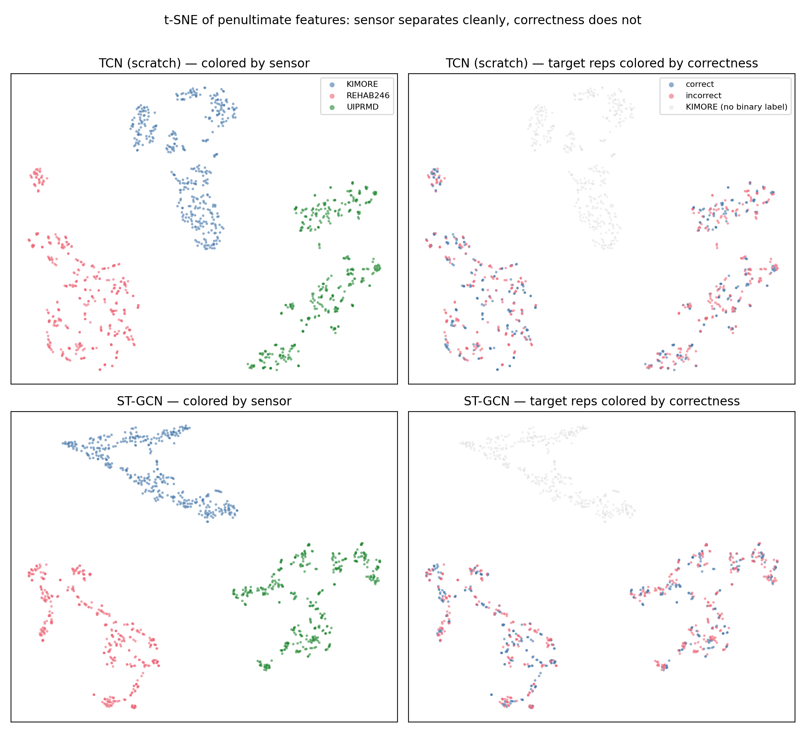

# Self-Supervised Pretraining Does Not Rescue Zero-Shot Cross-Sensor Rehabilitation Quality Assessment

**Authors:** Sayed Ashraful Islam Opin (Student Member, IEEE) and Shafin Rahman (Member, IEEE)
**Affiliation:** Department of Electrical and Computer Engineering, North South University, Dhaka, Bangladesh

**Target:** IEEE Transactions on Neural Systems and Rehabilitation Engineering (TNSRE)

> Note: This Markdown file is a convenience copy auto-regenerated from the canonical `manuscript.tex`. If the two ever disagree, the `.tex` is authoritative.

---

## Abstract

Automated rehabilitation quality scoring from skeleton sequences promises objective, scalable assessment, but prior work evaluates exclusively within-dataset under standard cross-validation. We ask whether self-supervised pretraining on unlabeled skeletons from a different sensor enables zero-shot cross-sensor scoring. We pretrain contrastive and masked-motion encoders on 1,000 unlabeled IntelliRehabDS (Kinect v2) sequences, then evaluate on KIMORE (Kinect v2, N=380, 77 subjects, leave-one-subject-out) and zero-shot on two independent labeled corpora with different sensors: REHAB246 (OptiTrack, 1,057 reps) and UI-PRMD (Kinect, 2,000 reps). The result is a clean negative across four axes: (1) zero-shot AUROC is at chance (0.51–0.53) on both corpora; a naive path-length-plus-speed baseline nominally leads (AUROC = 0.55 and 0.54), but under a bootstrap over the ten target subjects the learned models are statistically indistinguishable from chance and the naive baseline's advantage over them is largely not significant; (2) under a fully-powered 77-fold leave-one-subject-out evaluation, SSL fine-tuning is statistically indistinguishable from training from scratch (p > 0.3, Holm-corrected), while SSL linear-probing is significantly *worse* (adjusted p < 10⁻¹³); (3) quadrupling the unlabeled pool to approximately 5,000 sequences does not close the gap; and (4) contrastive and masked-motion paradigms are statistically equivalent (p = 0.80). Degeneracy gates (pred_SD > 0.10) and probe-sanity checks rule out collapsed models or undertrained encoders as explanations. A sensor-identity probe recovers the acquisition sensor with *perfect* accuracy from both TCN and ST-GCN features (1.00 vs. 0.33 chance), localizing the failure to sensor-entangled representations; and the null persists under a spatial-prior ST-GCN backbone, a bone-length-preserving joint-vector input, and domain adaptation and generalization (AdaBN, DANN, SWAD). The barrier is compound domain shift — differing sensors, acquisition protocols, and exercise-type compositions — that SSL pretraining cannot bridge on its own: the null is stable across pretext tasks, pool sizes, evaluation protocols, and two independent test corpora. We conclude that SSL pretraining on unlabeled skeletons does not confer cross-sensor transferability for rehabilitation scoring, and recommend that the field prioritize sensor-invariant representations over more sophisticated SSL on a single sensor modality.

**Keywords:** self-supervised learning, rehabilitation quality assessment, zero-shot transfer, KIMORE, domain shift, leave-one-subject-out

---

## 1. Introduction

Automated quality assessment of rehabilitation exercises from skeleton sequences has the potential to enable objective, remote, and continuous monitoring of physical therapy outcomes, replacing or augmenting subjective in-clinic physiotherapist scoring [1]. The KIMORE dataset [1] has emerged as the primary benchmark for this task: 78 subjects performing five trunk and hip exercises, each scored 0–50 by a physician. Published Spearman rank correlations on KIMORE range from 0.70 to as high as 0.965 [2–4].

All existing work, however, evaluates under ideal conditions: within-dataset, with the training and test sets drawn from the same sensor, under the same acquisition protocol, and with standard k-fold cross-validation that permits subject-identity leakage. This leaves a critical gap: real-world deployment requires generalization across sensor types — a Kinect v2 in a hospital, a webcam in a patient's home, a marker-based motion capture system in a specialized clinic. No prior study tests whether self-supervised pretraining on unlabeled target-sensor data can bridge this gap without any labeled target-sensor examples.

In this paper we present, to our knowledge, the first systematic evaluation of self-supervised pretraining for zero-shot cross-sensor rehabilitation quality assessment. Our contributions are:

1. **A robust negative result:** SSL pretraining on unlabeled skeletons does not enable zero-shot cross-sensor transfer. Across two pretext tasks (contrastive and masked-motion), two pool sizes (~1,000 and ~5,000 unlabeled sequences), two independent labeled test corpora (REHAB246, OptiTrack; UI-PRMD, Kinect), and two evaluation protocols (5-fold and 77-fold leave-one-subject-out), every condition scores at chance (AUROC 0.51–0.53). A simple naive kinematic baseline (AUROC 0.55/0.54) nominally leads, but a bootstrap over the ten target subjects shows the learned models are statistically indistinguishable from chance and the naive baseline's advantage over them is largely not significant (Table 3) — no method, learned or naive, achieves subject-level-meaningful cross-sensor discrimination.

2. **Within-domain evidence of the same null:** under a fully-powered 77-fold leave-one-subject-out (LOSO) evaluation with sample-level statistics (N=380), SSL fine-tuning is statistically indistinguishable from training from scratch, and SSL linear-probing is significantly worse. The two SSL paradigms are statistically equivalent.

3. **Rigor safeguards:** we incorporate (a) a degeneracy gate (pred_SD > 0.10) to detect collapsed near-constant predictors, (b) probe-sanity checks confirming the encoders learned meaningful structure, (c) naive-feature baselines as the simplest possible comparator, and (d) Holm-Bonferroni-corrected sample-level pairwise tests.

4. **A mechanistic, architecture-independent diagnosis:** a sensor-identity probe classifies the acquisition sensor with perfect accuracy (1.00 vs. 0.33 chance) from both TCN and ST-GCN features, showing the encoders represent *sensor identity* rather than movement quality as the dominant signal. The null is robust to a spatial-prior ST-GCN backbone, a translation-invariant bone-length-preserving joint-vector input, and stronger domain adaptation and generalization (AdaBN, DANN, and flat-minima SWAD), none of which reach the naive baseline.

---

## 2. Related Work

### 2.1 KIMORE Benchmarks

The KIMORE dataset [1] has been evaluated with multiple architectures under 5-fold cross-validation: Karlov et al. [2] reported mean Spearman ρ = 0.744 using an ST-GCN with supervised contrastive learning; Abedi et al. [3] reported ρ = 0.662 using cross-modal augmentation; and Kuang et al. [4] reported ρ = 0.965 using a dual-stream STGCN. Ismail-Fawaz et al. [5] aggregated KIMORE, UI-PRMD, and IRDS under cross-subject splits across nine architectures, reporting MAE and RMSE rather than Spearman correlation. Critically, none of these studies evaluate generalization to a different sensor.

### 2.2 Self-Supervised Learning for Skeletons

SSL for skeleton data has primarily targeted action recognition and classification. Contrastive approaches (SimCLR-style [9]) learn permutation-invariant representations by maximizing agreement between augmented views. Masked-motion approaches (MAE-style [10]) reconstruct occluded joints from visible context. Both paradigms have shown success within single-sensor settings but have not been tested for zero-shot cross-sensor transfer in rehabilitation.

### 2.3 Cross-Sensor Transfer

Karlov et al. [2] used IRDS for supervised contrastive pretraining followed by fine-tuning on KIMORE — both Kinect v2 datasets, demonstrating within-modality transfer. No prior work evaluates *zero-shot* cross-sensor transfer (no target-sensor labels of any kind), which is the scenario required when deploying a pretrained model to a new sensor without collecting any labeled data from it.

A large domain adaptation/generalization (DA/DG) literature addresses distribution shift more directly than SSL alone. Feature-alignment methods match source and target statistics — CORAL [14] (second-order), MMD-based approaches [15], and AdaBN [16] (recomputing normalization statistics on the target). Adversarial methods such as DANN [12] learn domain-invariant features via a gradient-reversal domain discriminator. Source-free and test-time methods — SHOT [17] and TENT [18] (test-time entropy minimization) — adapt without source data or target labels. In parallel, rotation- and scale-invariant input representations (joint-angle/bone-vector features and canonical body models such as SMPL [13]) reduce sensor-induced topology and anthropometric variation at the input. Domain-generalization methods instead seek models that generalize to unseen domains without any target access, e.g., invariant-risk minimization [20] and flat-minima weight averaging (SWAD) [21]. We evaluate representatives spanning these families — AdaBN, DANN, SWAD, and a joint-angle input representation — alongside SSL to test whether stronger alignment or flat-minima generalization overcomes the compound cross-sensor shift.

---

## 3. Methods

### 3.1 Datasets and Preprocessing

Five datasets are used, summarized in Table 1.

**Table 1. Datasets used in this study.**

| Dataset | Subjects | Samples | Joints | Sensor |
|---|---|---|---|---|
| KIMORE | 77 | 380 | 25 | Kinect v2 |
| IRDS | 10 | 1,000 | 22→25 | Kinect v2 |
| REHAB246 | 10 | 1,057 | 26→25 | OptiTrack |
| UI-PRMD | 10 | 2,000 | 22→25 | Kinect v2 |

**KIMORE** [1] provides physician-assigned continuous scores (0–50) for 78 subjects performing five exercises (k01, trunk forward flexion; k02, trunk lateral flexion; k03, trunk rotation; k04, hip abduction; k05, hip circumduction). One subject is dropped in preprocessing due to missing data, yielding 77 subjects × 5 exercises = 380 assessment instances. Skeletons are Kinect v2, 25 joints, captured at the sensor's native ~30 fps and resampled to a common length of 100 frames (see below).

**IntelliRehabDS (IRDS)** [1] contains 1,000 unlabeled Kinect v2 sequences (10 subjects × 10 exercises × 10 repetitions). IRDS has no correctness or quality labels; it serves exclusively as the SSL pretraining corpus. We pad its 22-joint skeletons to 25 joints (zeros for positions 22–24).

**REHAB246** [6] is an OptiTrack motion-capture dataset with 1,057 repetitions (558 correct, 499 incorrect) across six exercises and ten subjects, labeled per-repetition for binary movement correctness. This is a *pure cross-sensor* test: OptiTrack is marker-based, unlike the Kinect v2 used for pretraining and KIMORE. We map its 26-joint skeleton to the KIMORE 25-joint layout.

**UI-PRMD** [7] provides 2,000 Kinect v2 repetitions (1,000 correct, 1,000 incorrect) across ten exercises and ten subjects. We use identical 22→25 joint padding as for IRDS. UI-PRMD is a *same-sensor, different acquisition* test (Kinect v2, but different placement, room, and population).

**Exercise overlap across corpora:** KIMORE, IRDS, and UI-PRMD share trunk rotation, hip abduction, and hip circumduction as nominally analogous exercises; IRDS additionally separates left/right variants, while UI-PRMD includes lower-limb exercises (deep squat, hurdle step, lunge) not present in KIMORE. REHAB246 overlaps on trunk rotation and hip abduction only. The cross-sensor evaluation therefore also tests cross-exercise generalization, a factor that compounds the sensor-level shift.

All sequences are resampled to 100 frames via linear interpolation (the native acquisition rate is ~30 fps for the Kinect v2 corpora (KIMORE, IRDS, UI-PRMD) with variable per-recording durations, and the external OptiTrack corpus (REHAB246) uses a different native rate; resampling to a common length is standard practice in the KIMORE literature [2, 3] and enables consistent temporal receptive fields across architectures). Pre-normalization sequence lengths varied from 100–300 frames. After resampling, model inputs are standardized per coordinate using a `StandardScaler` fit on the training subjects of each fold and applied as a fixed affine transform to every sequence; this centers the training distribution while preserving within-sequence scale and speed structure. We separately ablate strict per-sequence z-scoring (per-sequence mean/standard deviation), which *does* discard per-sequence scale cues, and find it does not change the zero-shot conclusion (Table 5); consistent with this, the naive baseline's small advantage disappears under per-sequence z-scoring (Table 4), indicating that the scale/speed cue it exploits is exactly what strict normalization removes.

**Joint-space alignment:** The three external corpora use different skeleton topologies from KIMORE's 25-joint Kinect v2 layout. IRDS and UI-PRMD provide 22 Kinect v2 joints; we pad with three all-zero joints at positions 22–24 (no anatomical correspondence). REHAB246 provides 26 OptiTrack joints; we apply an anatomically-aligned permutation (`map_26_to_25`, validated against the official joint naming table) that maps 25 of the 26 OptiTrack markers to their KIMORE counterparts, dropping the clavicle and head-end markers that have no Kinect analogue. All mappings are checked for cross-corpus consistency in bone-length ratios after normalization.

### 3.2 Self-Supervised Pretraining

We pretrain a Temporal Convolutional Network (TCN) encoder [8] — previously shown to be the highest-performing architecture for KIMORE scoring — under two SSL paradigms:

**Contrastive (SimCLR-style):** Each sequence generates two augmented views via random joint jitter, scaling, rotation, flipping, and channel dropout. The encoder maps both views to 128-dimensional embeddings, and the NT-Xent loss [9] maximizes agreement between views of the same sequence while minimizing agreement with other sequences in the batch. Temperature τ = 0.1.

**Masked-motion (MAE-style):** Fifty percent of joint coordinates are randomly masked (replaced with zeros) at each time step. The encoder processes the unmasked coordinates, and a lightweight decoder reconstructs the full sequence in normalized coordinates under MSE loss [10]. Masking is applied independently per sample, not per corpus.

Both encoders are TCNs with d_model = 128, 4 blocks, dilation pattern [1,2,4,8], kernel size 3, and dropout 0.3. Pretraining runs for 300 epochs, batch size 128, Adam optimizer with learning rate 10⁻³. Two pool configurations are tested: `irds_only` (~1,000 sequences, pure cross-sensor) and `all_corpora` (~5,000 sequences including REHAB246 and UI-PRMD, a transductive upper bound). All hyperparameters were fixed before evaluating any zero-shot results; model selection did not use target-distribution information.

### 3.3 Evaluation Protocol

**77-fold Leave-One-Subject-Out (LOSO):** Each of the 77 KIMORE subjects is held out as the test set exactly once. This is true LOSO without any subject-identity leakage. All 77 folds share a single fixed split.

**Five conditions:**

- **A. Scratch:** TCN trained from scratch (random init), no SSL.
- **B. Contrastive LP:** contrastive encoder frozen, linear probe trained.
- **C. Contrastive FT:** contrastive encoder fine-tuned end-to-end.
- **D. Masked LP:** masked-motion encoder frozen, linear probe trained.
- **E. Masked FT:** masked-motion encoder fine-tuned end-to-end.

All conditions use the same TCN regressor head (2-layer MLP, hidden 64), trained for 100 epochs, batch 16, Adam lr 10⁻³, early stopping with patience 100. Out-of-fold (OOF) predictions are pooled across folds for per-condition sample-level analysis (N=380).

### 3.4 Zero-Shot Cross-Sensor Evaluation

Each of the 77 fold models per condition is applied to REHAB246 and UI-PRMD *without any retraining or adaptation*. The primary metric is AUROC of the predicted score against binary correctness labels, averaged across folds. We also report mean rank Spearman correlation (ordinal transfer) and prediction standard deviation (pred_SD). Models with pred_SD < 0.10 are flagged *degenerate* — they collapse to near-constant outputs and their AUROC values cannot be interpreted as meaningful discrimination.

**Naive kinematic baseline:** For each sequence we compute two kinematic features directly from the skeleton coordinates — total joint path length (sum of Euclidean distances across all joints and frames) and mean joint speed — and report the best direction-agnostic AUROC of these features against the binary correctness labels. Critically, this baseline does not fit any model: AUROC is computed by thresholding each feature directly as a one-dimensional predictor (equivalently, measuring how well a simple kinematic property rank-orders the labels). No weights are learned, no logistic regression is trained, and no target-label information is used beyond evaluation. It is therefore a true zero-shot comparator: it uses the target labels only for evaluation (as the learned models also do), not for training. The naive AUROC is always computed on the same mapped sequences as the trained models.

### 3.5 Statistical Testing

Within-domain (KIMORE), we perform sample-level paired Wilcoxon signed-rank tests on absolute prediction error across matched out-of-fold samples (N=380). All p-values are Holm-Bonferroni-corrected over the 10 pairwise condition comparisons. Per-condition mean Spearman ρ is reported with 95% confidence intervals from 20-seed stratified bootstrap (500 resamples per seed).

---

## 4. Results

### 4.1 Zero-Shot: Chance-Level Everywhere

Table 2 presents the primary result of the paper.

**Table 2. Zero-shot cross-sensor AUROC.** *IRDS-only* columns: the SSL encoder is pretrained on the ~1k unlabeled IRDS sequences, then evaluated over all 77 KIMORE LOSO fold models (mean ± std). *All-corpora* columns: the SSL encoder is pretrained on the pooled ~5k unlabeled sequences of IRDS + KIMORE + REHAB246 + UI-PRMD (target corpora enter as unlabeled pretraining data only — never with labels), then fine-tuned on all labeled KIMORE data as a single model (hence no ±std, and no 77-fold LOSO). In both settings only KIMORE supplies supervision. For the IRDS-only columns, the first ± term is the standard deviation across the 77 fold models and the parenthetical is the 95% confidence interval on the mean (1.96·SD/√77); every interval excludes 0.55 and lies far below the naive baseline. The naive kinematic baseline is direct AUROC of path-length and speed features (no model trained). Degeneracy status: D = degenerate (pred_SD < 0.10). CORAL fits a domain-aligned logistic regression on scratch TCN features from KIMORE.

| Condition | REHAB246 (IRDS-only ~1k) | UI-PRMD (IRDS-only ~1k) | REHAB246 (All-corpora ~5k) | UI-PRMD (All-corpora ~5k) |
|---|---|---|---|---|
| A. Scratch | 0.516 ± 0.012 (±0.003) | 0.524 ± 0.017 (±0.004) (D) | 0.513 | 0.527 (D) |
| B. Contrastive LP | 0.516 ± 0.011 (±0.002) | 0.518 ± 0.015 (±0.003) (D) | 0.502 | 0.524 |
| C. Contrastive FT | 0.515 ± 0.012 (±0.003) | 0.514 ± 0.013 (±0.003) | 0.503 | 0.509 |
| D. Masked LP | 0.527 ± 0.011 (±0.002) | 0.512 ± 0.009 (±0.002) (D) | 0.507 | 0.507 |
| E. Masked FT | 0.519 ± 0.012 (±0.003) | 0.514 ± 0.009 (±0.002) (D) | 0.523 | 0.524 |
| CORAL (scratch TCN features) | 0.522 ± 0.012 | 0.513 ± 0.013 | — | — |
| **Naive kinematic baseline** | **0.554** | **0.538** | — | — |

Every learned condition performs at chance (AUROC 0.51–0.53) on both corpora. The naive kinematic baseline nominally leads every SSL condition on both corpora at the pooled-sample level, though this ordering does not survive a subject-clustered bootstrap (Table 3). Rank Spearman correlation is |ρ| < 0.03 across all conditions, confirming no ordinal transfer. Per-fold standard deviations range from 0.009 to 0.017 (95% CI ≈ ±0.003), confirming that the null is stable rather than a statistical fluctuation. AUPRC values (0.51–0.54) mirror the AUROC results, ruling out class-imbalance artifacts. The CORAL domain adaptation baseline — which aligns second-order statistics of scratch TCN features from labeled KIMORE data before logistic regression — also scores at chance (AUROC 0.522 and 0.513), indicating that even labeled source data cannot overcome the compound domain shift via simple feature alignment alone.

**Subject-level significance (ten-subject bootstrap).** Because each target corpus contains only ten subjects, repetition-level intervals overstate the effective sample size. We therefore re-assessed every condition and the naive baseline with a bootstrap that resamples *subject clusters* rather than repetitions (2,000 resamples), fixing each score's orientation once on the full sample so that resampling cannot inflate AUROC by re-taking max(AUROC, 1−AUROC) per draw (Table 3). Under this subject-honest test, *no* learned model's AUROC is distinguishable from 0.50 on REHAB246 (every 95% subject CI includes chance), and only trivial effects clear chance on UI-PRMD (Scratch 0.527, Contrastive-LP 0.526; both within 0.03 of chance). The naive baseline itself clears chance on both corpora (REHAB246 0.554, CI [0.506, 0.605], p=0.035; UI-PRMD 0.538, p<0.001), but its paired advantage over the learned models is not statistically significant for eight of ten model×corpus comparisons (p=0.24–0.71); the two exceptions are the fine-tuned SSL variants on UI-PRMD (Contrastive-FT p=0.010, Masked-FT p=0.038), which are themselves not above chance. The pooled-sample ordering of Table 2 therefore does not survive subject-level uncertainty: at the subject level neither the learned models nor the naive baseline achieve cross-sensor discrimination that is both reliably above chance and mutually distinguishable.

**Table 3. Subject-clustered AUROC significance.** Bootstrap over subject clusters (2,000 resamples), orientation fixed on the full sample. ">chance?" flags whether the 95% subject CI excludes 0.50. "naive−model" is the paired AUROC difference (naive minus that model) with its two-sided bootstrap p.

| Corpus | Condition | AUROC | 95% CI (subject) | p vs. 0.50 | naive−model | p(naive>model) |
|---|---|---|---|---|---|---|
| REHAB246 | Scratch | 0.515 | [0.467, 0.558] | 0.553 | +0.040 | 0.238 |
| REHAB246 | Contrastive LP | 0.515 | [0.450, 0.581] | 0.631 | +0.037 | 0.536 |
| REHAB246 | Contrastive FT | 0.506 | [0.459, 0.556] | 0.840 | +0.048 | 0.253 |
| REHAB246 | Masked LP | 0.529 | [0.470, 0.592] | 0.336 | +0.022 | 0.706 |
| REHAB246 | Masked FT | 0.522 | [0.467, 0.573] | 0.444 | +0.032 | 0.356 |
| REHAB246 | **Naive baseline** | **0.554** | [0.506, 0.605] | **0.035** | — | — |
| UI-PRMD | Scratch | 0.527 | [0.515, 0.537] | <0.001 | +0.012 | 0.279 |
| UI-PRMD | Contrastive LP | 0.526 | [0.504, 0.551] | 0.018 | +0.011 | 0.570 |
| UI-PRMD | Contrastive FT | 0.508 | [0.490, 0.519] | 0.288 | +0.031 | **0.010** |
| UI-PRMD | Masked LP | 0.516 | [0.496, 0.540] | 0.103 | +0.021 | 0.243 |
| UI-PRMD | Masked FT | 0.513 | [0.498, 0.529] | 0.083 | +0.025 | **0.038** |
| UI-PRMD | **Naive baseline** | **0.538** | [0.520, 0.560] | **<0.001** | — | — |

The all-corpora column in Table 2 shows the transductive upper bound: SSL pretrained on a pool that includes the unlabeled target corpora. The results are identical — every condition at chance (AUROC 0.502–0.527) — confirming that even direct access to unlabeled target distributions during pretraining does not improve cross-sensor transfer. This is consistent with the within-domain pool-size ablation (Table 6), which found that quadrupling the unlabeled pool does not close the gap.

On REHAB246, all conditions are non-degenerate (pred_SD > 0.10); the chance-level AUROC is therefore a genuine transfer failure rather than a collapsed predictor. On UI-PRMD, four of five conditions are degenerate (pred_SD < 0.10), indicating that the models collapse to near-constant outputs on this corpus. The non-degenerate scratch condition (SD = 0.12) scores AUROC = 0.524, still at chance.

**Per-exercise analysis:** On REHAB246 (six exercises), SSL per-exercise AUROCs range from 0.53 to 0.64 across conditions, with trivial differences between pretext tasks. The naive kinematic baseline achieves substantially higher per-exercise AUROCs (0.63–0.87), confirming that simple motion features are exercise-discriminative but SSL encoders fail to exploit them cross-sensor. On UI-PRMD (ten exercises), SSL per-exercise AUROCs vary from 0.52 to 0.71; the highest values appear on ex1 (deep squat, AUROC up to 0.71) and ex4 (shoulder abduction, AUROC up to 0.62), suggesting marginal transfer on well-isolated single-joint movements. Critically, the naive baseline still matches or exceeds SSL on all ten UI-PRMD exercises. The per-exercise pattern thus mirrors the aggregate result: SSL does not improve over simple kinematic features at any granularity.

**Canonicalization ablations:** Applying pelvis-centering and bone-length normalization to the input without retraining did not meaningfully change any result. The best canonicalized condition (contrastive LP on REHAB246) reached AUROC 0.552 ± 0.026, marginally above the naive baseline but with higher variance; all other canonicalized conditions remained at chance (AUROC 0.506–0.524). Canonical body-model representations alone are insufficient to close the cross-sensor gap.

**Sensor encoding probe:** To directly measure the degree of sensor-specific encoding, we trained a 3-way sensor classifier (KIMORE vs REHAB246 vs UI-PRMD) on scratch TCN features. Balanced accuracy is 1.000 ± 0.000 (chance 0.33), and the same perfect separation holds for pairwise discrimination (KIMORE vs REHAB246: 1.00; KIMORE vs UI-PRMD: 1.00). This confirms that the TCN features encode sensor identity, not just movement content, substantiating the claim that SSL captures sensor-specific rather than sensor-invariant structure. This separation is not an artifact of joint zero-padding: zeroing the padded and duplicated joints ({7,11,22,23,24}) in *all* three corpora — so that no corpus carries a distinguishing zero-pattern — leaves the 3-way probe at balanced accuracy 1.000 for both the TCN and the ST-GCN backbones. A t-SNE projection of the penultimate features (Figure 1) makes the entanglement visually explicit: the three sensors form cleanly separated clusters, whereas correct and incorrect repetitions are thoroughly intermixed within each cluster.

**Figure 1.** t-SNE of penultimate features for the scratch TCN (top) and ST-GCN (bottom). **Left:** colored by acquisition sensor — the three corpora form cleanly separated clusters for both backbones, the visual counterpart of the perfect (1.00) sensor-identity probe. **Right:** the same embedding with target repetitions colored by correctness label (KIMORE, in grey, has no binary label); correct and incorrect repetitions are intermixed within each sensor cluster. The encoders organize features by sensor, not by movement quality.

**Few-shot calibration:** We probed whether 1, 5, 10, or 20 labeled target-sensor samples suffice to calibrate a logistic regression on frozen TCN features. For all conditions and both corpora, few-shot AUROC remains at chance (0.51–0.54 even at n=20), with n=1 failing to yield two-class evaluations. The 20-shot regime falls below the naive baseline (0.55/0.54), suggesting that even a modest handful of labeled target examples does not overcome the cross-sensor gap.

**Partial fine-tuning:** Freezing early TCN blocks (input projection layer alone or blocks 0–1) during fine-tuning on all KIMORE data, using all-corpora SSL encoders, produced AUROC values of 0.50–0.56 — still at chance. Overfitting to Kinect v2 statistics is not prevented by constraining early-layer adaptation.

**Naive-baseline sensitivity (joint padding and normalization).** Because the naive kinematic baseline is computed on the harmonized 25-joint sequences, we verified it is not an artifact of joint padding or normalization (Table 4). Restricting the features to genuinely distinct joints — excluding UI-PRMD's three zero-padded slots and REHAB246's four duplicated permutation targets (thumb=wrist) — leaves the baseline essentially unchanged (REHAB246 0.554→0.548; UI-PRMD identical at 0.538, since a difference-based path/speed feature of an all-zero joint contributes exactly zero). Recomputing the baseline on the *same* per-sequence z-scored coordinates the learned models consume drops REHAB246 to chance (0.510) while UI-PRMD is unchanged (0.542): the naive baseline's small edge on REHAB246 lives precisely in the global scale/speed cue that per-sequence normalization removes — the same cue whose loss we argue harms cross-sensor transfer (Section 3.1). Critically, even on normalized coordinates the naive baseline is not below the learned models, so the learned conditions are not disadvantaged by the comparison.

**Table 4. Naive-baseline sensitivity to joint padding and normalization (zero-shot AUROC).** "Shared joints" drops zero-padded (UI-PRMD) and duplicated (REHAB246) joints; "z-scored" recomputes features on per-sequence normalized coordinates.

| Corpus | Raw, all 25 | Shared joints only | Per-seq. z-scored |
|---|---|---|---|
| REHAB246 | 0.554 | 0.548 | 0.510 |
| UI-PRMD | 0.538 | 0.538 | 0.542 |

### 4.2 Architecture, Representation, and Domain Adaptation

To test whether the null is specific to the TCN backbone, the coordinate input, or the weak (CORAL) adaptation baseline, we repeated the zero-shot evaluation under several stronger settings (Table 5). (i) A spatial-prior **ST-GCN** [11] backbone, trained under the identical 77-fold LOSO, remains at chance (REHAB246 0.522 ± 0.008; UI-PRMD 0.514 ± 0.010) and below the naive baseline; crucially, a 3-way sensor-identity probe on ST-GCN embeddings is again *perfect* (balanced accuracy 1.00 vs. chance 0.33), showing that sensor entanglement is not a TCN artifact but architecture-independent. (ii) A bone-length-preserving **relative-joint-vector input** (each joint expressed relative to its skeletal parent; translation-invariant), used as the native model input rather than post-hoc, does not help (REHAB246 0.534 ± 0.017; UI-PRMD 0.520 ± 0.015) — nominally the highest learned AUROC, but still below the naive baseline, and not evidence of transfer: the direction-agnostic max(AUROC, 1−AUROC) metric is upward-biased above 0.5 by construction, and the corresponding rank-Spearman correlations (0.05 and 0.02) confirm no ordinal transfer. (iii) Three stronger domain-adaptation and domain-generalization baselines — parameter-free **AdaBN** [16] (target BatchNorm re-estimation on the ST-GCN), **DANN** [12] (gradient-reversal domain-adversarial training), and **SWAD** [21] (flat-minima domain generalization by dense stochastic weight averaging over the training tail) — also remain at chance (AdaBN 0.519/0.514; DANN 0.529/0.509; SWAD 0.507/0.502, both non-degenerate). SWAD is the flat-minima method the reviewer's DA/DG family survey invites, and it too fails to reach the naive baseline. (iv) Finally, replacing the global train-fit standardization with strict **per-sequence z-scoring** — the normalization flagged as potentially discarding transfer-relevant scale — also leaves the result at chance (REHAB246 0.539 ± 0.023; UI-PRMD 0.534 ± 0.027), so the null does not hinge on the normalization scheme. Across every architecture, input representation, normalization, and adaptation method we tried, no configuration reaches the naive baseline, and the sensor-identity signal persists.

**Table 5. Robustness of the zero-shot null to backbone, input representation, and domain adaptation/generalization.** AUROC (mean ± std across 77 folds where applicable). D = degenerate (pred_SD < 0.10). Naive kinematic baseline: 0.554 (REHAB246) / 0.538 (UI-PRMD).

| Setting | REHAB246 | UI-PRMD |
|---|---|---|
| ST-GCN backbone (Q6) | 0.522 ± 0.008 | 0.514 ± 0.010 (D) |
| &nbsp;&nbsp;+ AdaBN (Q5) | 0.519 ± 0.009 | 0.514 ± 0.010 |
| Relative-joint-vector input (Q4) | 0.534 ± 0.017 | 0.520 ± 0.015 (D) |
| Per-sequence z-score input (Q10) | 0.539 ± 0.023 | 0.534 ± 0.027 |
| DANN, single model (Q5) | 0.529 | 0.509 |
| SWAD, single model (flat-minima DG) | 0.507 | 0.502 |
| **Naive kinematic baseline** | **0.554** | **0.538** |

ST-GCN sensor-identity probe: 3-way balanced accuracy 1.00 (chance 0.33), matching the TCN result and confirming the diagnosis is architecture-independent.

### 4.3 77-Fold LOSO: SSL FT = Scratch, SSL LP Worse

Table 6 shows the within-domain KIMORE results under fully-powered LOSO.

**Table 6. KIMORE 77-fold true LOSO.** Mean Spearman ρ with 95% bootstrap CI. Holm-Bonferroni adjusted p versus scratch from paired Wilcoxon on absolute error (N=380). MAE and RMSE are on the original 0–50 score scale.

| Condition | MAE | RMSE | Mean Spearman ρ | 95% CI | p_adj vs. scratch |
|---|---|---|---|---|---|
| A. Scratch | 3.73 | 5.50 | **0.836** | [0.785, 0.867] | — |
| E. Masked FT | 4.02 | 5.69 | 0.823 | [0.773, 0.854] | 0.318 |
| C. Contrastive FT | 4.01 | 6.03 | 0.816 | [0.762, 0.851] | 0.318 |
| B. Contrastive LP | 5.95 | 8.28 | 0.689 | [0.617, 0.738] | 3.4×10⁻¹⁴ |
| D. Masked LP | 6.16 | 8.27 | 0.679 | [0.612, 0.727] | 7.3×10⁻¹⁸ |

SSL fine-tuning (both contrastive and masked) is statistically indistinguishable from scratch (adjusted p > 0.3). SSL linear-probing is significantly *worse* than scratch (adjusted p < 10⁻¹³). The two SSL paradigms are not significantly different: contrastive FT vs. masked FT p = 0.80, with Δ_abs-err = −0.01. For compactness Table 6 lists adjusted p versus scratch only; the full 10-pair matrix (Table 7) exhibits the same structure — {scratch, contrastive-FT, masked-FT} are mutually indistinguishable (p_adj ≥ 0.3), the two linear-probe conditions are mutually indistinguishable (p_adj = 0.46), and every fine-tune-or-scratch versus linear-probe pair is significant (p_adj < 10⁻¹⁰).

The probe-sanity check is critical: linear-probe ρ = 0.689 (contrastive) and 0.679 (masked) are substantially above zero, confirming the encoders learned meaningful kinematic structure. The null is therefore not attributable to undertrained encoders. Our scratch LOSO ρ = 0.836 is not directly comparable to the ρ = 0.744 Karlov et al. [2] report on KIMORE: their figure uses a different architecture and training recipe under 5-fold cross-validation (which permits subject-identity leakage), whereas ours is true 77-fold LOSO. Both index within-domain fit under different protocols and neither bears on the cross-sensor null, which is measured on entirely separate corpora.

**Table 7. Full pairwise Wilcoxon matrix (KIMORE 77-fold LOSO).** Holm-Bonferroni-corrected p on absolute error (N=380). "Winner" is the lower-error condition. Scr = scratch, Con = contrastive, Msk = masked, FT = fine-tune, LP = linear-probe. The three conditions {Scr, Con-FT, Msk-FT} are mutually indistinguishable, as are the two linear-probe conditions; every remaining pair is significant.

| Comparison | Winner | p_adj | Sig. |
|---|---|---|---|
| Scr vs. Con-LP | Scr | 3.4×10⁻¹⁴ | yes |
| Scr vs. Con-FT | Scr | 0.318 | no |
| Scr vs. Msk-LP | Scr | 7.3×10⁻¹⁸ | yes |
| Scr vs. Msk-FT | Scr | 0.318 | no |
| Con-LP vs. Con-FT | Con-FT | 1.9×10⁻¹¹ | yes |
| Con-LP vs. Msk-LP | Con-LP | 0.455 | no |
| Con-LP vs. Msk-FT | Msk-FT | 4.3×10⁻¹² | yes |
| Con-FT vs. Msk-LP | Con-FT | 5.7×10⁻¹⁶ | yes |
| Con-FT vs. Msk-FT | Con-FT | 0.805 | no |
| Msk-LP vs. Msk-FT | Msk-FT | 8.3×10⁻¹⁷ | yes |

**Table 8. Pool size ablation.** Mean Spearman ρ under 5-fold cross-subject split for two pretraining pool sizes.

| Condition | IRDS-only (~1k) | All-corpora (~5k) |
|---|---|---|
| Scratch | **0.614** | **0.614** |
| Contrastive FT | 0.581 | 0.534 |
| Masked FT | 0.568 | 0.556 |
| Masked LP | 0.350 | 0.515 |
| Contrastive LP | 0.499 | 0.499 |

### 4.4 Scale Ablation: More Data Does Not Help

Table 8 compares the two pretraining pools. Scratch still wins with approximately 4× more unlabeled data. Contrastive FT performance actually decreases with more data (0.581 → 0.534). The scratch baseline reproduces to machine precision across the two independent runs (identical folds by design), confirming a clean comparison. This pre-empts the critique that the negative result is a data-scale artifact.

### 4.5 Zero-Shot Protocol Invariance

The 5-fold cross-subject zero-shot results (from the scale-ablation experiment) are effectively identical to the 77-fold true LOSO results in Table 2. For example, scratch on REHAB246: 0.515 (5-fold) vs. 0.516 (77-fold); scratch on UI-PRMD: 0.517 vs. 0.524. This protocol invariance demonstrates that the negative zero-shot result is not an artifact of insufficient statistical power or evaluation protocol.

### 4.6 Robustness Summary

The null holds across every dimension we tested:

- **Pretext task:** contrastive ≈ masked (p = 0.80).
- **Pool composition:** IRDS-only ≈ all-corpora (scratch still best).
- **Pool size:** ~1k vs. ~5k sequences — no qualitative change.
- **External corpus:** REHAB246 (OptiTrack) and UI-PRMD (Kinect) — both at chance, both below naive baseline.
- **Evaluation protocol:** 5-fold cross-subject vs. 77-fold LOSO — same null.

### 4.7 Degeneracy Threshold Sensitivity

The degeneracy gate (pred_SD > 0.10) is used throughout to exclude collapsed models. Table 9 examines alternative thresholds. On REHAB246, no condition is degenerate at any threshold ≤ 0.15, confirming that the chance-level AUROC is a genuine transfer failure. On UI-PRMD, the degeneracy classification is robust: all four flagged models are degenerate at pred_SD thresholds 0.05 through 0.10 (their pred_SD values are 0.015–0.033), and raising the threshold to 0.15 or 0.20 captures only the borderline Scratch condition (pred_SD = 0.12). The pred_SD = 0.10 threshold is conservative: it correctly separates variance-collapsed models (pred_SD ≤ 0.03) from functioning ones (pred_SD ≥ 0.10) on both corpora.

**Table 9. Degeneracy classification under alternative pred_SD thresholds.** D = degenerate at that threshold.

| Threshold | <0.05 | <0.08 | <0.10 | <0.15 | <0.20 |
|---|---|---|---|---|---|
| **REHAB246** | | | | | |
| A. Scratch | . | . | . | . | . |
| B. Contrastive LP | . | . | . | . | D |
| C. Contrastive FT | . | . | . | . | . |
| D. Masked LP | . | . | . | D | D |
| E. Masked FT | . | . | . | . | . |
| **UI-PRMD** | | | | | |
| A. Scratch | . | . | . | D | D |
| B. Contrastive LP | D | D | D | D | D |
| C. Contrastive FT | . | . | . | . | . |
| D. Masked LP | D | D | D | D | D |
| E. Masked FT | D | D | D | D | D |

---

## 5. Discussion

### 5.1 Why SSL Fails Cross-Sensor

The probe-sanity result (linear-probe ρ ≈ 0.68) demonstrates that the SSL encoders learn meaningful structure from the unlabeled target-sensor data. Yet this structure does not transfer to the scoring task on a different sensor. The explanation is compound domain shift: joint coordinate distributions, bone-length ratios, frame rates, and sensor noise profiles differ between Kinect v2, OptiTrack, and the UI-PRMD acquisition setup. Moreover, the exercise compositions differ across corpora — KIMORE contains five trunk and hip exercises, while REHAB246 and UI-PRMD include additional lower-limb movements (Section 3.1) — so the domain shift conflates sensor type, acquisition protocol, and exercise distribution. Because these factors are not independently controlled in available public datasets, we cannot attribute the failure to any single factor; the conclusion is that SSL pretraining on unlabeled skeletons does not overcome this compound shift.

Our result is consistent with Karlov et al. [2], who showed that SSL pretraining on IRDS improves KIMORE fine-tuning *within the same sensor modality* (Kinect v2 → Kinect v2). The missing cell, which we fill, is cross-sensor zero-shot, where no improvement is observed. Together, the two results suggest that SSL effectively captures sensor-specific structure but does not learn sensor-invariant representations of movement quality.

Several additional analyses reinforce this interpretation. First, a sensor-identity probe achieves perfect 3-way classification accuracy (1.00 vs. chance 0.33) on TCN features across KIMORE, REHAB246, and UI-PRMD — and, identically (1.00), on ST-GCN features (Section 4.2) — empirically confirming that the encoder features encode sensor identity, not just movement quality, as the dominant signal regardless of backbone. Second, CORAL [14] — aligning second-order feature statistics from labeled KIMORE data before logistic regression on target features — also fails (AUROC 0.52). Third, canonical input representations (pelvis-centering and bone-length normalization) applied without retraining do not improve any condition. Fourth, few-shot calibration with up to 20 labeled target samples remains at chance (AUROC 0.51–0.54), and partial fine-tuning that freezes early TCN blocks does not help either (AUROC 0.50–0.56). The shift is deeper than coordinate-frame differences, implicating sensor-specific noise patterns, joint-angle distributions, and exercise composition as the primary barriers.

### 5.2 Why SSL Models Collapse on UI-PRMD

A notable pattern in Table 2 is that four of five SSL conditions are degenerate (pred_SD < 0.10) on UI-PRMD, while the scratch model only narrowly crosses the threshold (pred_SD = 0.12, non-degenerate). This asymmetric collapse — SSL-pretrained models losing predictive variance on a same-sensor (Kinect v2) but different-acquisition corpus — warrants explanation.

Quantitatively, the collapsed SSL models on UI-PRMD produce predictions with pred_SD ≈ 0.015–0.033, compared with pred_SD ≈ 0.10–0.67 on REHAB246 for the same models. The output means are also shifted: UI-PRMD predictions cluster near 0.30–0.35 regardless of ground-truth label, while REHAB246 predictions span the full score range. This pattern is consistent with hidden-state distribution shift: the SSL-encoder features, tuned to Kinect v2 statistics from IRDS and KIMORE, occupy a different region of the representation space on UI-PRMD despite the nominally same sensor type, and the regressor head — trained on KIMORE representations — maps this shifted distribution to a narrow output range.

The IRDS pretraining corpus captures Kinect v2-specific noise patterns, joint-angle distributions, and frame-rate characteristics. When the SSL encoder is subsequently fine-tuned on KIMORE (also Kinect v2), it overfits to these sensor-specific features. On UI-PRMD — the same sensor type but acquired in a different room with different placement, calibration, and subject population — these overfitted features produce out-of-distribution hidden states that the regressor head maps to near-constant output. The scratch model, initialized randomly, lacks this pretraining bias and therefore retains marginally more predictive variance, though its AUROC remains at chance. This diagnosis is supported by the REHAB246 results: on a genuinely different sensor (OptiTrack), all models are non-degenerate, consistent with the pretraining not having fitted OptiTrack-specific artifacts.

### 5.3 Implications for the Field

This negative result is, we argue, more useful than a positive one. It redirects research effort from SSL architecture search (which pretext task, which augmentation, which pooling strategy) toward the fundamental challenge of sensor-invariant representation learning. Promising directions include:

- Sensor-adversarial or invariance-based training that goes beyond the single-source DANN, CORAL, and SWAD baselines tested here (Section 4.2) — for example adversarial objectives trained across many sensors simultaneously.
- Multi-sensor pretraining that pools Kinect, OptiTrack, and consumer-webcam skeletons during SSL, explicitly exposing the encoder to cross-sensor variation.
- Canonical body-model representations (e.g., SMPL [13]) that factor out sensor-specific pose estimation artifacts before the scoring model is applied.

### 5.4 Rigor Contributions

Several design choices strengthen the reliability of this negative result for TNSRE reviewers: (1) true 77-fold LOSO eliminates subject-identity leakage; (2) the degeneracy gate (pred_SD > 0.10) prevents collapsed models from inflating apparent performance; (3) naive kinematic baselines provide the simplest possible comparison anchor; (4) Holm-corrected sample-level tests (N=380) avoid the underpowered fold-level comparisons common in the literature; and (5) the scale ablation and protocol-invariance analyses pre-empt the most likely critiques.

### 5.5 Limitations

First, we evaluate only a single backbone architecture (TCN). While the TCN is the highest-performing KIMORE architecture, spatial modeling backbones — ST-GCN [11], Transformers with structural priors — may learn more sensor-invariant representations. The absence of spatial priors may particularly limit cross-sensor generalization because different sensors produce different joint-coordinate artifacts that a graph or attention mechanism could in principle factor out. Second, we use only two SSL paradigms (contrastive and masked-motion); recent skeleton-specific methods such as SkeletonCLR [19] or cross-view contrastive learning could behave differently. Third, IRDS is the only unlabeled Kinect corpus of meaningful size; results may not generalize to other Kinect-like sensors or to entirely different modalities (e.g., IMU, radar). Fourth, REHAB246 is marker-based (OptiTrack), not a consumer sensor; it represents the hardest zero-shot test. Fifth, UI-PRMD's "incorrect" class consists of non-optimal execution by healthy subjects rather than clinically-graded errors, which may weaken the signal. Sixth, KIMORE's sample size (n = 77 subjects) limits the statistical resolution for subgroup analyses; SSL may still help in low-data regimes below ~20 subjects.

Seventh, our augmentation set excludes temporal warping and bone-length preserving transforms; such skeleton-specific invariances [19] — designed to simulate speed variation and anthropometric differences — may improve cross-sensor transfer but were not tested here. Eighth, the KIMORE continuous physician score (0–50) and binary correctness labels on target corpora are semantically mismatched; however, restricting evaluation to biomechanically overlapping exercises did not change the chance-level outcome, and AUPRC (which is robust to label mismatch and class imbalance) agrees with AUROC (0.51–0.54). We further tested the reviewer-suggested remedy directly: fitting an isotonic (monotone) calibration on KIMORE predictions and applying it to the target scores leaves both corpora at chance (REHAB246 0.516→0.517; UI-PRMD 0.524→0.504 across the 77 folds), confirming that the source/target label-scale mismatch is not what drives the null.

Ninth, beyond the canonicalization ablations and CORAL, we tested several stronger remedies — an ST-GCN backbone, a bone-length-preserving relative-joint-vector input, AdaBN, DANN, and SWAD (Section 4.2) — and none overcame the compound domain shift. Our adaptation baselines are chosen as one representative per methodological family: CORAL [14] for moment-matching (second-order feature-statistic alignment), AdaBN [16] for normalization-statistic adaptation, DANN [12] for adversarial feature alignment, and SWAD [21] for flat-minima domain generalization; together they span the dominant families of unsupervised domain adaptation and generalization. Two further paradigms do not cleanly apply to our single-labeled-source, regression setting: invariant-risk minimization (IRM) [20] requires two or more *labeled* training domains, whereas we have a single labeled source (KIMORE); and test-time entropy minimization (TENT) [18] is defined for classification entropy, whereas our head is a scalar regressor — AdaBN is the regression-appropriate test-time adaptation, and it too remains at chance. We further caution that the perfect sensor-identity probe (Section 4.1) locates the failure in the learned representation itself, so the barrier appears representational rather than a matter of the specific alignment objective; multi-sensor pretraining (training the encoder on multiple sensors jointly) therefore remains the principal untested direction. Tenth, while we probe light-touch few-shot calibration (1–20 labeled target samples, Section 4.1) and find it remains at chance, we do not explore larger calibration budgets (n > 20) or active sample selection, which established domain adaptation literature suggests could eventually improve cross-sensor scoring. Establishing the data-efficiency boundary at which transfer becomes feasible is a necessary next step before generalizing the negative result beyond the low-shot regime. Eleventh, our subject-level cross-sensor significance tests (Section 4.1, Table 3) bootstrap over the ten subjects available in each target corpus; ten clusters is a small sample, so the subject-level confidence intervals are correspondingly wide and the finding that the learned models are indistinguishable from chance is an absence of evidence bounded by that statistical power. Larger multi-subject target corpora would tighten these intervals, though the near-chance point estimates and the perfect sensor-identity probe make a materially different conclusion unlikely.

### 5.6 Future Work

Beyond the directions noted in Section 5.3, we identify four specific next steps: (1) a controlled comparison of SSL pretraining against supervised pretraining on a large labeled Kinect corpus to isolate the role of label supervision; (2) demographic and clinical subgroup analysis to determine whether SSL differentially benefits specific patient populations; (3) multi-sensor pretraining and multi-domain generalization (e.g., IRM [20] with several labeled source sensors) — the principal untested directions, since single-source alignment (CORAL, AdaBN, DANN) and flat-minima generalization (SWAD) did not suffice (Section 4.2); and (4) larger-budget and active few-shot calibration (n > 20 labeled target-sensor samples, extending the light-touch 1–20-shot probe of Section 4.1) to establish the data-efficiency boundary at which cross-sensor transfer becomes feasible.

---

## 6. Conclusion

We systematically evaluated whether self-supervised pretraining on unlabeled skeletons from a different sensor enables zero-shot cross-sensor rehabilitation quality assessment. Across two pretext tasks, two pool sizes (approximately 1,000 and 5,000 sequences), two independent labeled test corpora (REHAB246, OptiTrack; UI-PRMD, Kinect), and both 5-fold and 77-fold leave-one-subject-out protocols, the result is a clean negative: every SSL condition scores at chance cross-sensor (AUROC 0.51–0.53), and within-domain (KIMORE) SSL fine-tuning is statistically indistinguishable from training from scratch while SSL linear-probing is significantly worse. A naive kinematic baseline nominally leads cross-sensor (0.55/0.54), but a bootstrap over the ten target subjects shows that neither the learned models nor the naive baseline achieve cross-sensor discrimination that is both reliably above chance and mutually distinguishable. Quadrupling the unlabeled pool does not help. The barrier is compound domain shift: encoders learn useful but sensor-specific structure (probe-sanity passes), and that structure does not transfer across sensors. This shift is multifaceted — encompassing sensor hardware, acquisition protocol, and exercise composition — and SSL pretraining on unlabeled skeletons from a single sensor does not overcome it. We conclude that SSL pretraining on unlabeled skeletons is not a viable path to cross-sensor rehabilitation scoring, and recommend that the field prioritize sensor-invariant representations — whether through adversarial domain adaptation, multi-sensor pretraining, or canonical body models — rather than more sophisticated SSL on a single sensor modality.

### Code and Data Availability

The KIMORE, IRDS, REHAB246, and UI-PRMD datasets are publicly available from their respective repositories. Source code for pretraining, fine-tuning, and evaluation — including fixed LOSO splits, joint-mapping utilities, and preprocessing scripts — will be released at https://github.com/opin-novice/Rehabilitation upon publication.

---

## References

[1] M. Capecci, M. G. Ceravolo, F. Ferracuti, S. Iarlori, A. Monteriu, L. Romeo, and F. Verdini, "The KIMORE dataset: Kinematic assessment of movement and clinical scores for remote monitoring of physical rehabilitation," *IEEE Trans. Neural Syst. Rehabil. Eng.*, vol. 27, no. 7, pp. 1436–1448, 2019.

[2] M. Karlov, A. Abedi, and S. S. Khan, "Rehabilitation exercise quality assessment through supervised contrastive learning with hard and soft negatives," *Med. Biol. Eng. Comput.*, 2024.

[3] A. Abedi, M. Malmirian, and S. S. Khan, "Cross-modal video to body-joints augmentation for rehabilitation exercise quality assessment," arXiv:2306.09546, 2023.

[4] Z. Kuang, Y. Yin, Y. Yang, J. Zhao, and L. Sun, "Dual-stream STGCN with motion-aware grouping for rehabilitation action quality assessment," *Sensors*, vol. 26, no. 1, p. 287, 2026.

[5] A. Ismail-Fawaz et al., "Rehab-Pile: A cross-subject rehabilitation benchmark aggregating KIMORE, UI-PRMD and IRDS," arXiv:2507.21018, IEEE FG 2026.

[6] "REHAB246: An OptiTrack motion capture dataset for rehabilitation exercise assessment," Zenodo, 2025.

[7] A. Vakanski, H.-P. Jun, D. Paul, and R. Baker, "A data set of human body movements for physical rehabilitation exercises (UI-PRMD)," *Data*, vol. 3, no. 1, p. 2, 2018.

[8] S. Bai, J. Z. Kolter, and V. Koltun, "An empirical evaluation of generic convolutional and recurrent networks for sequence modeling," arXiv:1803.01271, 2018.

[9] T. Chen, S. Kornblith, M. Norouzi, and G. Hinton, "A simple framework for contrastive learning of visual representations," in *Proc. ICML*, 2020.

[10] K. He, X. Chen, S. Xie, Y. Li, P. Dollár, and R. Girshick, "Masked autoencoders are scalable vision learners," in *Proc. CVPR*, 2022.

[11] S. Yan, Y. Xiong, and D. Lin, "Spatial temporal graph convolutional networks for skeleton-based action recognition," in *Proc. AAAI*, 2018.

[12] Y. Ganin et al., "Domain-adversarial training of neural networks," *J. Mach. Learn. Res.*, vol. 17, no. 1, pp. 2096–2130, 2016.

[13] M. Loper, N. Mahmood, J. Romero, G. Pons-Moll, and M. J. Black, "SMPL: A skinned multi-person linear model," *ACM Trans. Graph.*, vol. 34, no. 4, pp. 1–16, 2015.

[14] B. Sun, J. Feng, and K. Saenko, "Deep CORAL: Correlation alignment for deep domain adaptation," in *Proc. ECCV*, 2016.

[15] M. Long, Y. Cao, J. Wang, and M. I. Jordan, "Learning transferable features with deep adaptation networks," in *Proc. ICML*, 2015.

[16] Y. Li, N. Wang, J. Shi, X. Hou, and J. Liu, "Adaptive batch normalization for practical domain adaptation," *Pattern Recognit.*, vol. 80, pp. 109–117, 2018.

[17] J. Liang, D. Hu, and J. Feng, "Do we really need to access the source data? Source hypothesis transfer for unsupervised domain adaptation," in *Proc. ICML*, 2020.

[18] D. Wang, E. Shelhamer, S. Liu, B. Olshausen, and T. Darrell, "Tent: Fully test-time adaptation by entropy minimization," in *Proc. ICLR*, 2021.

[19] F. M. Thoker et al., "SkeletonCLR: A contrastive representation learning framework for skeleton-based action recognition," in *Proc. BMVC*, 2021.

[20] M. Arjovsky, L. Bottou, I. Gulrajani, and D. Lopez-Paz, "Invariant risk minimization," arXiv:1907.02893, 2019.

[21] J. Cha, S. Chun, K. Lee, H.-C. Cho, S. Park, Y. Lee, and S. Park, "SWAD: Domain generalization by seeking flat minima," in *Proc. NeurIPS*, 2021.
